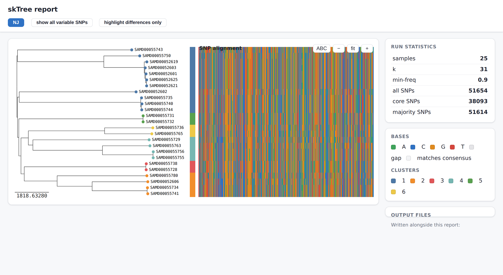

# skTree

Reference-free, alignment-free SNP discovery and phylogenetic tree building for
closely related bacterial genomes — a convenience **wrapper around
[SKA2](https://github.com/bacpop/ska.rust)**, the Rust split-k-mer engine.

skTree drives the fast `ska` binary for the heavy k-mer work and wraps its output
into an end-to-end phylogenetics workflow in Python: optimal-k selection,
core/majority SNP partitioning, a SNP matrix, and neighbor-joining / parsimony /
maximum-likelihood trees.



*The self-contained `--html` report on a real 25-isolate panel (~52k SNPs): an
interactive tree — here neighbor-joining, tips colored by fastbaps cluster —
beside the full SNP alignment, with run statistics and population-structure
clusters, all in one file that opens offline in any browser.*

> **Scope.** Like SKA, skTree is built for *closely related* isolates (outbreak /
> surveillance scale). Recall degrades beyond ~1% sequence divergence — skTree
> warns you when inputs look too divergent.

## Install

```bash
# 1. the SKA2 engine (Rust)
cargo install ska          # or: conda install -c bioconda ska2

# 2. skTree
uv pip install -e .             # from a checkout
uv pip install -e ".[annotate]" # + reference-based gene annotation (pyrodigal)
```

## Docker

The image bundles everything — the Rust `ska` engine, skTree, pyrodigal (for
`--reference` annotation), and IQ-TREE (for `--ml`) — so nothing else is needed:

```bash
docker build -t sktree .

# mount a directory of genomes as /data; outputs land back in ./results
docker run --rm -v "$PWD:/data" sktree \
  run sample1.fasta sample2.fasta sample3.fasta -o results --auto-k --parsimony --ml --reference sample1.fasta
```

The container runs as a non-root user and treats `/data` as the working
directory. Pin the engine with `--build-arg SKA_VERSION=0.5.1` if needed.

## Quick start

```bash
# neighbor-joining tree, auto-selected k
sktree run genomes/*.fasta -o results/ --auto-k

# add maximum-parsimony (pure Python) and maximum-likelihood (needs IQ-TREE/RAxML)
sktree run genomes/*.fasta -o results/ --auto-k --parsimony --ml

# annotate SNPs by gene against a reference (needs the [annotate] extra)
sktree run genomes/*.fasta -o results/ --auto-k --reference ref.fasta

# self-contained interactive HTML report (open results/report.html in any browser)
sktree run genomes/*.fasta -o results/ --html
```

### Outputs (`results/`)

| File | Contents |
|------|----------|
| `combined.skf` | SKA2 split-k-mer file for all samples |
| `alignment.fasta` | reference-free SNP alignment (variable sites) |
| `snp_matrix.tsv` | per-locus alleles, labelled core / majority / SNP |
| `core_snps.fasta` | core SNP alignment (sites present in every sample) |
| `distances.tsv` | pairwise SKA SNP distances |
| `tree_nj.nwk` | neighbor-joining tree (always) |
| `tree_parsimony.nwk` | maximum-parsimony tree (`--parsimony`) |
| `tree_ml.treefile` | maximum-likelihood tree (`--ml`, if an engine is on PATH) |
| `tree_ml.iqtree` | IQ-TREE report: model picked by ModelFinder, log-likelihood (`--ml`) |
| `tree_ml.log` | IQ-TREE run log, plus checkpoint/distance side files (`--ml`) |
| `reference_snps.vcf` | SNPs in reference coordinates (`--reference`) |
| `snp_annotation.tsv` | per-SNP gene + codon effect (`--reference`, needs `[annotate]`) |
| `ref_aligned.fasta` | reference-anchored pseudo-alignment from `ska map`, one row per sample at reference coordinates (`--reference`) |
| `tree_ref_nj.nwk` | reference-anchored neighbor-joining tree (`--map-tree`) |
| `tree_ref_parsimony.nwk` | reference-anchored maximum-parsimony tree (`--map-tree --parsimony`) |
| `tree_ref_ml.treefile` | reference-anchored maximum-likelihood tree, IQ-TREE (`--map-tree --ml`) |
| `clusters.csv` | population-structure cluster per sample (`--cluster`, needs `fastbaps`) |
| `report.html` | self-contained interactive report: trees + alignment + stats (`--html`) |
| `summary.txt` | run parameters and SNP counts |

### Key options

| Flag | Meaning |
|------|---------|
| `-k N` / `--auto-k` | fixed odd k-mer size, or Kchooser-style auto-selection |
| `-m / --min-freq F` | min fraction of samples a k-mer must appear in (default 0.9) |
| `--majority-threshold F` | present-fraction cutoff for a "majority" SNP (default 0.5) |
| `--parsimony` / `--ml` | also build parsimony / ML trees (`--ml` lets IQ-TREE pick the model via ModelFinder) |
| `--reference REF` | map SNPs onto `REF`: annotate by gene (needs `[annotate]`) and write the reference-anchored `ref_aligned.fasta` |
| `--map-tree` | build reference-anchored tree(s) from `ref_aligned.fasta` (requires `--reference`; honors `--ml` / `--parsimony`) |
| `--cluster` | assign population-structure clusters with `fastbaps` (writes `clusters.csv`) |
| `--html` | write a self-contained interactive HTML report (runs `fastbaps` if available) |
| `--threads N` | CPU threads passed to SKA |

See `docs/PLAN.md` for the output contract, `docs/RESEARCH.md` for the design
rationale, and `FOR-DEVELOPERS.md` for the architecture deep-dive.

## Applications: `ska map` vs read mapping (bwa/minimap2)

`--reference`/`--map-tree` use SKA2's `ska map`, which slides each sample's
split k-mers along a reference and records the middle base wherever the two
flanks match the reference exactly. That makes it fast and alignment-free, but
it is **split-k-mer matching, not read mapping** — it only resolves substitutions
at positions whose flanking context is conserved. Anything that breaks the
flanks (indels, recombination, divergent or accessory sequence) simply drops out
as missing. Knowing where that boundary sits tells you when to reach for `ska
map` and when to reach for bwa/minimap2 instead.

### Tree building

A reference-anchored alignment gives every column a genomic coordinate, so you
can mask known repeats/recombination tracts, line trees up across studies that
share a reference, and read variants positionally. The cost is **reference
bias**: only sites whose flanks match the reference are recovered, so a distant
or poorly-chosen reference silently shrinks the alignment. skTree's default
reference-free `tree_nj`/`tree_ml` stay bias-free and are the better choice for a
diverse panel; use `--map-tree` when coordinates and cross-study comparability
matter more than maximal site recovery, and pick a reference close to the panel.

## Benchmark vs kSNP4

Head-to-head against **kSNP4 v4.1** under identical resource caps (4 CPU / 12 GB,
swap off, matched k=21), across three test families:

| test | scope | speed | memory | core-SNP concordance |
|---|---|---|---|---|
| Head-to-head | 8× *C. auris* cohorts (~12 Mb) | 4–5× faster | ~5× leaner | identical on related sets |
| Scaling | *C. auris* n = 25 / 50 / 100 | ~8–10× faster | converges by n=100 | identical to the locus |
| Cross-species | *E. coli*, *Salmonella*, *Shigella*, *Pseudomonas* (close + diverse) | 2.2–5.1× faster | 3.1–4.8× leaner | identical (close) / ≤3 SNPs of up to ~69 000 (diverse) |

Two things stand out. **Correctness:** an independent SKA2-based tool
matches kSNP4's core-SNP calls to the locus on closely-related cohorts and to within
three SNPs out of tens of thousands on diverse ones, across four bacterial genera
plus a fungal one. **Scaling is bounded by disk, not RAM:** kSNP4's Jellyfish
scratch peaks near **90 GB** at n=100 and needs a ~200 GB volume to finish, where
skTree uses a few GB. (skTree's one weak axis is its optional pure-Python parsimony,
which is `O(n³·sites)`; use NJ or `--ml` past a few thousand SNPs.)

Full methodology and results in [`benchmarks/README.md`](benchmarks/README.md).

## Status

Feature-complete: build → SNPs → NJ/parsimony/ML trees → reports, plus optional
reference-based SNP annotation (`ska map` + pyrodigal gene calling) and
reference-anchored map-trees (`--map-tree`), covered by 95 tests. See
`docs/PLAN.md` for the full milestone history.
