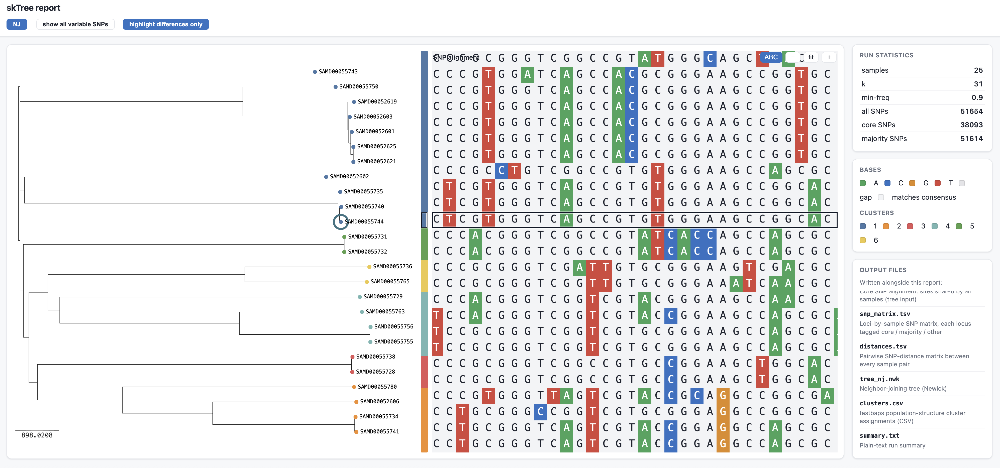

# skTree

Reference-free, alignment-free SNP discovery and phylogenetic tree building for
closely related bacterial genomes — a convenience **wrapper around
[SKA2](https://github.com/bacpop/ska.rust)**, the Rust split-k-mer engine.

skTree drives the fast `ska` binary for the heavy k-mer work and wraps its output
into an end-to-end phylogenetics workflow in Python: optimal-k selection,
core/majority SNP partitioning, a SNP matrix, and neighbor-joining / parsimony /
maximum-likelihood trees.


*The self-contained `--html` report on a real 25-isolate panel (~52k SNPs): an
interactive tree — here neighbor-joining, tips colored by fastbaps cluster —
beside the full SNP alignment, with run statistics and population-structure
clusters, all in one file that opens offline in any browser.*



*Zoomed in: the alignment is a real per-base SNP grid (A/C/G/T color-coded, with
a "highlight differences only" toggle), and selecting a tree tip links it across
to its row — handy for tracing which isolate carries which allele. The side
panel keeps the run statistics, base legend, fastbaps clusters, and the list of
output files one glance away.*

> **Scope.** Like SKA, skTree is built for *closely related* isolates (outbreak /
> surveillance scale). Recall degrades beyond ~1% sequence divergence — skTree
> warns you when inputs look too divergent.

## Install

```bash
# 1. the SKA2 engine (Rust)
cargo install ska          # or: conda install -c bioconda ska2

# 2. skTree
uv pip install -e .             # from a checkout
uv pip install -e ".[annotate]" # + reference-based gene annotation (pyrodigal)
```

## Docker

The image bundles everything — the Rust `ska` engine, skTree, pyrodigal (for
`--reference` annotation), and IQ-TREE (for `--ml`) — so nothing else is needed:

```bash
docker build -t sktree .

# mount a directory of genomes as /data; outputs land back in ./results
docker run --rm -v "$PWD:/data" sktree \
  run sample1.fasta sample2.fasta sample3.fasta -o results --auto-k --parsimony --ml --reference sample1.fasta
```

The container runs as a non-root user and treats `/data` as the working
directory. Pin the engine with `--build-arg SKA_VERSION=0.5.1` if needed.

## Quick start

```bash
# neighbor-joining tree, auto-selected k
sktree run genomes/*.fasta -o results/ --auto-k

# build from FASTQ reads, or mix reads and assemblies — paired files auto-detect
sktree run strainA.fasta strainB_R1.fastq.gz strainB_R2.fastq.gz -o results/

# add maximum-parsimony (pure Python) and maximum-likelihood (needs IQ-TREE/RAxML)
sktree run genomes/*.fasta -o results/ --auto-k --parsimony --ml

# annotate SNPs by gene against a reference (needs the [annotate] extra)
sktree run genomes/*.fasta -o results/ --auto-k --reference ref.fasta

# self-contained interactive HTML report (open results/report.html in any browser)
sktree run genomes/*.fasta -o results/ --html
```

### Outputs (`results/`)

| File | Contents |
|------|----------|
| `combined.skf` | SKA2 split-k-mer file for all samples |
| `alignment.fasta` | reference-free SNP alignment (variable sites) |
| `snp_matrix.tsv` | per-locus alleles, labelled core / majority / SNP |
| `core_snps.fasta` | core SNP alignment (sites present in every sample) |
| `distances.tsv` | pairwise SKA SNP distances |
| `tree_nj.nwk` | neighbor-joining tree (always) |
| `tree_parsimony.nwk` | maximum-parsimony tree (`--parsimony`) |
| `tree_ml.treefile` | maximum-likelihood tree (`--ml`, if an engine is on PATH) |
| `tree_ml.iqtree` | IQ-TREE report: model picked by ModelFinder, log-likelihood (`--ml`) |
| `tree_ml.log` | IQ-TREE run log, plus checkpoint/distance side files (`--ml`) |
| `reference_snps.vcf` | SNPs in reference coordinates (`--reference`) |
| `snp_annotation.tsv` | per-SNP gene + codon effect (`--reference`, needs `[annotate]`) |
| `ref_aligned.fasta` | reference-anchored pseudo-alignment from `ska map`, one row per sample at reference coordinates (`--reference`) |
| `tree_ref_nj.nwk` | reference-anchored neighbor-joining tree (`--map-tree`) |
| `tree_ref_parsimony.nwk` | reference-anchored maximum-parsimony tree (`--map-tree --parsimony`) |
| `tree_ref_ml.treefile` | reference-anchored maximum-likelihood tree, IQ-TREE (`--map-tree --ml`) |
| `clusters.csv` | population-structure cluster per sample (`--cluster`, needs `fastbaps`) |
| `report.html` | self-contained interactive report: trees + alignment + stats (`--html`) |
| `summary.txt` | run parameters and SNP counts |
| `sktree.log` | full DEBUG run log: every `ska` command, timings, and any error (always written) |

### Key options

| Flag | Meaning |
|------|---------|
| `--manifest TSV` | sample sheet of inputs (see [Reads & manifests](#reads--manifests)); combines with positional files |
| `--min-count N` | min k-mer count for read samples; filters sequencing error (default 3; ignored for assemblies) |
| `--min-qual N` | min base quality for read samples (ska default 20) |
| `--qual-filter` | read quality strategy: `no-filter` / `middle` / `strict` (ska default strict) |
| `-k N` / `--auto-k` | fixed odd k-mer size, or Kchooser-style auto-selection (`--auto-k` needs at least one assembly) |
| `-m / --min-freq F` | min fraction of samples a k-mer must appear in (default 0.9) |
| `--majority-threshold F` | present-fraction cutoff for a "majority" SNP (default 0.5) |
| `--parsimony` / `--ml` | also build parsimony / ML trees (`--ml` lets IQ-TREE pick the model via ModelFinder) |
| `--reference REF` | map SNPs onto `REF`: annotate by gene (needs `[annotate]`) and write the reference-anchored `ref_aligned.fasta` |
| `--map-tree` | build reference-anchored tree(s) from `ref_aligned.fasta` (requires `--reference`; honors `--ml` / `--parsimony`) |
| `--cluster` | assign population-structure clusters with `fastbaps` (writes `clusters.csv`) |
| `--html` | write a self-contained interactive HTML report (runs `fastbaps` if available) |
| `--threads N` | CPU threads passed to SKA |
| `-v` / `--debug` | console verbosity: `-v` is INFO, `--debug` is DEBUG (the file log is always full DEBUG) |

See `docs/PLAN.md` for the output contract, `docs/RESEARCH.md` for the design
rationale, and `FOR-DEVELOPERS.md` for the architecture deep-dive.

## Reads & manifests

skTree builds trees from FASTA assemblies, paired-end FASTQ reads, or any mix of
the two in one run. SKA2 calls SNPs straight from reads — there is no separate
assembly step.

**Auto-pairing.** Pass both mates of a sample on the command line and skTree
groups them into one sample, recognising the common Illumina conventions
(`_R1`/`_R2`, `_R1_001`/`_R2_001`, `.R1`/`.R2`, `_1`/`_2`). The sample name is the
shared prefix, so `strainB_R1.fastq.gz` + `strainB_R2.fastq.gz` become one sample
named `strainB`:

```bash
sktree run strainA.fasta strainB_R1.fastq.gz strainB_R2.fastq.gz -o results/
```

**Manifest.** For explicit control over names and pairing, give a tab-separated
sample sheet instead of (or alongside) positional files. One sample per line:

```
strainA	strainA.fasta
strainB	strainB_R1.fastq.gz	strainB_R2.fastq.gz
```

```bash
sktree run --manifest samples.tsv -o results/
```

Two columns is an assembly (or a single file); three columns is a forward/reverse
read pair. Read-error filtering (`--min-count`, `--min-qual`, `--qual-filter`)
applies only to read samples; assemblies pass through untouched. Note that
`--auto-k` needs at least one assembly to probe k — a **reads-only** run keeps the
fixed `-k` (default 31) and logs a warning if `--auto-k` was requested.

## Debugging a failed run

Every run writes a full-detail log to `<outdir>/sktree.log`, no matter how quiet
the console was. It records the skTree version, the exact command line, the
resolved `ska` version, and **every `ska` invocation verbatim** — so when a run
fails you can see precisely which command broke and reproduce it by hand.

If a run fails, skTree prints the failing command and the engine's stderr, then
tells you where the full log is:

```
error: ska exited with code 101
  command: ska build -o out/combined -k 31 -f out/combined.filelist.tsv
  stderr : ... real.fasta has no valid sequence
See out/sktree.log for the full log.
```

`-v` raises the console to INFO and `--debug` to DEBUG, but neither is required
for the post-mortem: the file log is always at DEBUG. Attach `sktree.log` when
reporting an issue.

## Reference-anchored mode (`--reference` / `--map-tree`)

By default skTree is fully reference-free: the alignment and trees come from
`ska align`, where columns are matched k-mers with no genome coordinates. Two
optional flags add a reference-anchored view on top of that:

- **`--reference REF`** runs SKA2's `ska map` to place each sample's SNPs onto
  `REF`, giving every column a genomic coordinate. You get `ref_aligned.fasta`
  (one row per sample at reference positions) plus, with the `[annotate]` extra,
  per-SNP gene and codon-effect annotation.
- **`--map-tree`** builds trees from that reference-anchored alignment
  (`tree_ref_nj`, and `tree_ref_parsimony` / `tree_ref_ml` if you also pass
  `--parsimony` / `--ml`).

Use these when coordinates matter — to mask known repeat/recombination tracts or
to line trees up across studies that share a reference. The trade-off is
**reference bias**: `ska map` records a base only where a sample's k-mer flanks
match the reference exactly, so indels, recombination, and accessory or divergent
sequence drop out as missing, and a distant reference silently shrinks the
alignment. For a diverse panel, prefer the default reference-free
`tree_nj`/`tree_ml`; reach for `--map-tree` with a reference close to the panel.

## Benchmark vs kSNP4

Head-to-head against **kSNP4 v4.1** under identical resource caps (4 CPU / 12 GB,
swap off, matched k=21), across three test families:

| test | scope | speed | memory | core-SNP concordance |
|---|---|---|---|---|
| Head-to-head | 8× *C. auris* cohorts (~12 Mb) | 4–5× faster | ~5× leaner | identical on related sets |
| Scaling | *C. auris* n = 25 / 50 / 100 | ~8–10× faster | converges by n=100 | identical to the locus |
| Cross-species | *E. coli*, *Salmonella*, *Shigella*, *Pseudomonas* (close + diverse) | 2.2–5.1× faster | 3.1–4.8× leaner | identical (close) / ≤3 SNPs of up to ~69 000 (diverse) |

Two things stand out. **Correctness:** an independent SKA2-based tool
matches kSNP4's core-SNP calls to the locus on closely-related cohorts and to within
three SNPs out of tens of thousands on diverse ones, across four bacterial genera
plus a fungal one. **Scaling is bounded by disk, not RAM:** kSNP4's Jellyfish
scratch peaks near **90 GB** at n=100 and needs a ~200 GB volume to finish, where
skTree uses a few GB. (skTree's one weak axis is its optional pure-Python parsimony,
which is `O(n³·sites)`; use NJ or `--ml` past a few thousand SNPs.)

Full methodology and results in [`benchmarks/README.md`](benchmarks/README.md).

## Status

Feature-complete: assemblies and/or paired-end reads → SNPs →
NJ/parsimony/ML trees → reports, plus optional reference-based SNP annotation
(`ska map` + pyrodigal gene calling) and reference-anchored map-trees
(`--map-tree`), covered by 131 tests. See `docs/PLAN.md` for the full milestone
history.
